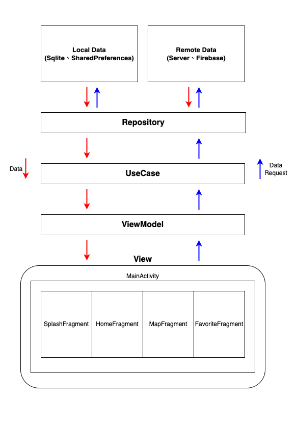

# 尋找Youbike
- [基本資料](#基本資料)
- [Demo](#demo)
- [Dependencies](#dependencies)
- [App架構](#app架構)
- [參考資料](#參考資料)

### 基本資料
- App名稱：尋找Youbike
- [Google Play連結](https://play.google.com/store/apps/details?id=com.demo.ubike)
- 可查詢各縣市的Youbike(1.0、2.0)數量，目前支援查詢縣市：台北市、新北市、桃園市、新竹縣、新竹市、苗栗縣、台中市、嘉義市、高雄市、台南市、屏東縣、金門縣

### Demo
- 
- [Demo影片](https://www.youtube.com/shorts/76vp86woB5U)

### Dependencies
1. 依賴注入
	+ [Hilt](https://developer.android.com/training/dependency-injection/hilt-android?hl=zh-tw)
2. 網路相關
	+ [Okhttp3](https://github.com/square/okhttp)
	+ [Retrofit2](https://github.com/square/retrofit)
	+ [Rxjava2](https://github.com/ReactiveX/RxJava)
3. 本地儲存相關
	+ [Room](https://developer.android.com/training/data-storage/room?hl=zh-tw)
	+ [Preference](https://developer.android.com/jetpack/androidx/releases/preference?hl=zh-cn)
4. 導航相關
	+ [Navigation](https://developer.android.com/jetpack/androidx/releases/navigation?hl=zh-cn)
5. Firebase相關
	+ [Firebase Analytics](https://firebase.google.com/docs/analytics/get-started?hl=zh-cn&platform=android)
	+ [Firebase Crashlytics](https://firebase.google.com/docs/crashlytics/?hl=zh-cn)
6. 權限相關
	+ [Easypermissions](https://github.com/googlesamples/easypermissions)
7. debug相關
	+ [Flipper](https://fbflipper.com/)

### App架構

### 參考資料
- [運輸資料流通服務平臺(Transport Data eXchange , TDX)](https://tdx.transportdata.tw)