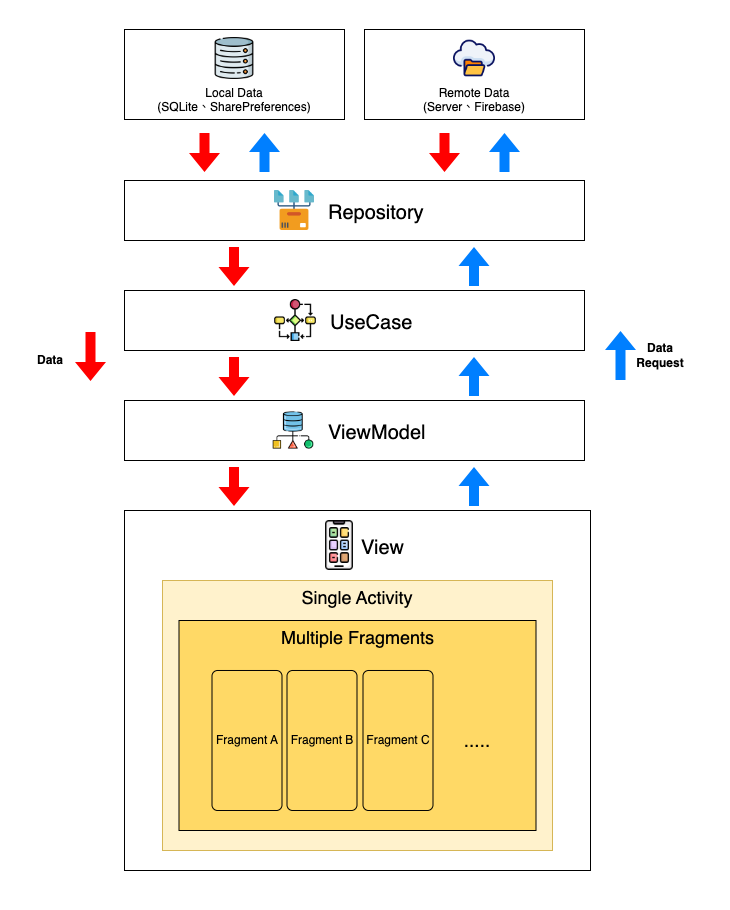

# 尋找Youbike
- [基本資料](#基本資料)
- [Demo](#demo)
- [Dependencies](#dependencies)
- [App架構](#app架構)
- [參考資料](#參考資料)


### 基本資料
- App名稱：尋找Youbike
- [Google Play連結](https://play.google.com/store/apps/details?id=com.demo.ubike)
- 可查詢各縣市的Youbike(1.0、2.0)數量，目前支援查詢縣市：台北市、新北市、桃園市、新竹縣、新竹市、苗栗縣、台中市、嘉義市、高雄市、台南市、屏東縣、金門縣


### Demo
- 
- [Demo影片](https://www.youtube.com/shorts/76vp86woB5U)

### Build Requirements
- Java版本: 17
- Gradle版本: 8.7
- Android Gradle Plugin(AGP)版本: 8.5.2
- Kotlin版本: 1.9.25
- 在專案根目錄中添加**secrets.properties**檔案，並添加以下內容(值替換成自己申請的)
```
your-project/
│── app/
│── secrets.properties      ← create this file
│── build.gradle
│── settings.gradle
```

```
API_CLIENT_ID_1=YOUR_CLIENT_ID
API_CLIENT_SECRET_1=YOUR_CLIENT_SECRET
API_CLIENT_ID_2=YOUR_CLIENT_ID
API_CLIENT_SECRET_2=YOUR_CLIENT_SECRET
API_CLIENT_ID_3=YOUR_CLIENT_ID
API_CLIENT_SECRET_3=YOUR_CLIENT_SECRET
KEYSTORE_FILE_PATH=YOUR_KEYSTORE_PATH
KEYSTORE_PASSWORD=YOUR_KEYSTORE_PASSWORD
KEYSTORE_ALIAS=YOUR_KEYSTORE_ALIAS
KEYSTORE_ALIAS_PASSWORD=YOUR_KEYSTORE_ALIAS_PASSWORD
MAPS_API_KEY=YOUR_GOOGLE_MAP_API_KEY
```

### Dependencies
1. Dependency injection
	+ [Hilt](https://developer.android.com/training/dependency-injection/hilt-android?hl=zh-tw)
2. Network
	+ [Okhttp3](https://github.com/square/okhttp)
	+ [Retrofit2](https://github.com/square/retrofit)
3. Storage
	+ [Room](https://developer.android.com/training/data-storage/room?hl=zh-tw)
4. Navigation
	+ [Navigation](https://developer.android.com/jetpack/androidx/releases/navigation?hl=zh-cn)
5. Firebase
	+ [Firebase Analytics](https://firebase.google.com/docs/analytics/get-started?hl=zh-cn&platform=android)
	+ [Firebase Crashlytics](https://firebase.google.com/docs/crashlytics/?hl=zh-cn)
6. Debug tool
	+ [Flipper](https://fbflipper.com/)


### App架構


### 參考資料
- [運輸資料流通服務平臺(Transport Data eXchange , TDX)](https://tdx.transportdata.tw)
- [Google Map Api](https://developers.google.com/maps/documentation/android-sdk/get-api-key?hl=zh-tw)